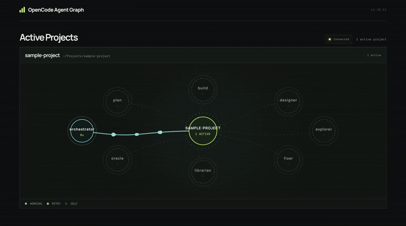

# OpenCode Agent Graph

OpenCode Agent Graph is a OpenCode plugin for seeing multi-agent work as it happens. It brings active agents, running sessions, work status, and recent tool activity into one focused dashboard, making parallel work easier to follow without switching between sessions.

## Demo



## Why use it

- See which agents are active and which sessions need attention.
- Understand parallel work in real time instead of checking sessions one by one.

## Requirements

- OpenCode with plugin support

## Quick start

Add the package name to `opencode.json`. OpenCode installs the plugin automatically on first use:

```json
{
  "$schema": "https://opencode.ai/config.json",
  "plugin": ["opencode-agent-graph"]
}
```

Pin a version when needed:

```json
{
  "$schema": "https://opencode.ai/config.json",
  "plugin": ["opencode-agent-graph@1.0.1"]
}
```

After OpenCode starts the plugin, open the dashboard:

```text
http://127.0.0.1:8818/
```

## Configuration

Dashboard default address is `http://127.0.0.1:8818/`.

Override host and port via plugin options or environment variables. Plugin options take precedence over env vars, which take precedence over defaults.

| Option | Default |
| --- | --- |
| `host` | `127.0.0.1` |
| `port` | `8818` |

Plugin options (tuple form in `opencode.json`):

```json
{
  "$schema": "https://opencode.ai/config.json",
  "plugin": [
    ["opencode-agent-graph", { "host": "0.0.0.0", "port": 9000 }]
  ]
}
```

Environment variables:

```sh
OPENCODE_AGENT_GRAPH_HOST=127.0.0.1
OPENCODE_AGENT_GRAPH_PORT=8818
```

## License

[MIT](LICENSE)
